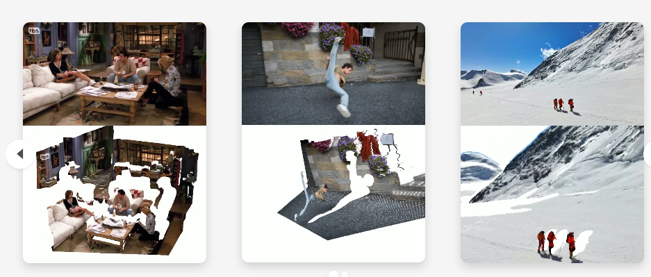

# AI-models-worth-saving

1. MoGe: Unlocking Accurate Monocular Geometry Estimation for Open-Domain Images with Optimal Training Supervision [https://wangrc.site/MoGePage/]
    - model directly predicts a 3D point map from a single image 
    - 